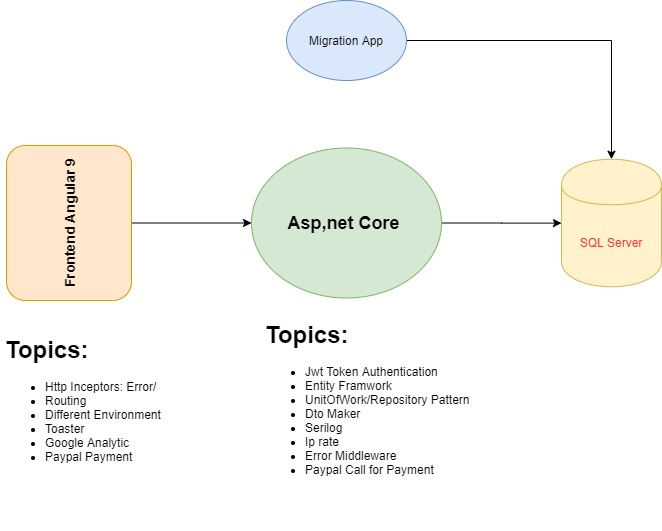

# Aspnet Core 3.1 + Angular 9+ Boilerplate
This is an asp.net core + Angular 9 Boilerplate 

This Boilerplate is a monolithic application works as Asp.net Core and Angualr 9. Here are the technologies I have used : 

**The structure** 

**Asp.net Core API:** 
An Asp.net core 3 simple api project. We create the asp.net core project separately as a back-end for the Angular app. 

Naming and structure: 
all the names starts with "Meys". Consider it as an example of a project. Then all the project can be named Mey.XXX like, 	Meys.Data, Meys.Service.Tests

Dependency Injection: 
The default IOC of the asp.net core is used. There is an extension ServiceExtensions.cs in this file I have created an extension for IServiceLocation and in that we have injected all the required depenencies. 

Entityframwork .net core: 
ROM is EF Core. All the Data related projects are in 1.Data folder. 
Meys.Domain: contains all the entity of the database. we have to keep this project separate of any other items other than entities because any other project can include them. 
Meys.Data: all files related to the pattern of unit of work and general repository implemented in UnitOfWorkAndGeneralRepo folder. 

**Angular 9,  Frontend app:**

**Migration App**: 
it is a console app written in c# to do the migration of the database with [this](https://fluentmigrator.github.io/articles/intro.html) package called : FluetnMigrator

